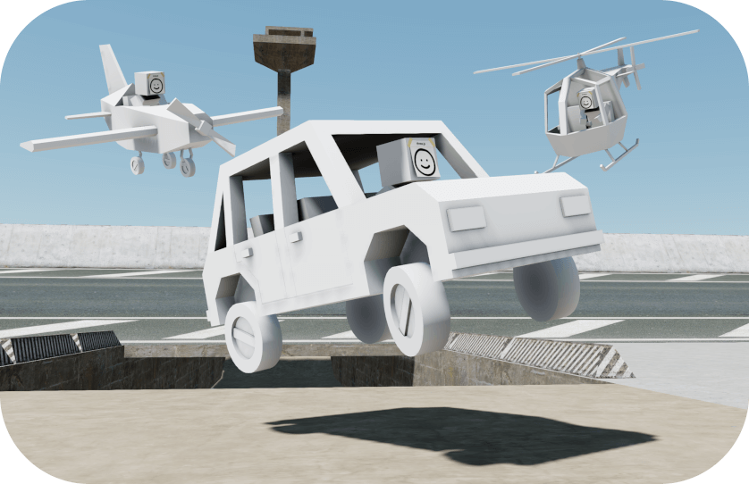

<p align="center">
	<a href="https://jblaha.art/sketchbook/latest"></a>
	<br>
	<a href="https://jblaha.art/sketchbook/latest">Live demo</a>
	<br>
</p>

[](https://www.npmjs.com/package/sketchbook)

# Final update (20. Feb 2023)

As I have no more interest in developing this project, it comes to a conclusion. In order to remain honest about the true state of the project.

# 📒 Sketchbook

Mostly a playground for exploring how conventional third person gameplay mechanics found in modern games work and recreating them in a general way.

## Features

* World
	* Three.js scene
	* Cannon.js physics
	* Variable timescale
	* Frame skipping
	* FXAA anti-aliasing
* Characters
	* Third-person camera
	* Raycast character controller with capsule collisions
	* General state system
	* Character AI
* Vehicles
	* Cars
	* Airplanes
	* Helicopters

All planned features can be found in the [GitHub Projects](https://github.com/amil3955/Sketchbook-3D.git).


<!-- #### Script tag -->

1. Import:

```html
<script src="sketchbook.min.js"></script>
```

2. Load a glb scene defined in Blender:

```javascript
const world = new Sketchbook.World('scene.glb');
```

<!--

#### NPM

1. Install:

```
npm i sketchbook
```

2. Import:

```javascript
import { World } from 'sketchbook';
```

3. Load a glb scene defined in Blender:

```javascript
const world = new World('scene.glb');
```

--> 


